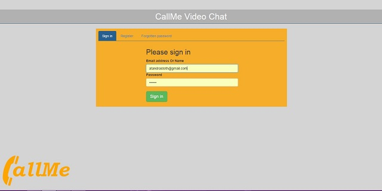

CallMe Video chat application
============================

CallMe is a very simple Video chat application

  - Very simple usage
  - Some importan options
  - Quick implementation
  - Registration with profile image
  - Password reminder


[CallMe] - Online Demo 



Version
----
0.0.1
Requirements
----
- PHP Webserver 5.5 Or above
- MYSQL Database

Installation
----
- Copy whole folder (callme) to your web server.
- Register on [PeerJS] website. Obtain your peer key.
- Fill the config.php with yours details.
- Start application
- After first launch, auto creating table 'callme_users' in the database

Usage
----
- Crate user (register) 
- Sign in with existing user
- Clikc another user on the left panel
- Press call button

Options
----
- Mute outgoing voice
- Disable outgoing video
- Go fullscreen

config.php (in folder callme)
--------------
```sh
<?php
$_SESSION['cfg'] = array(
	'SQL_CONN' => 'mysql:host=HOST;dbname=DB_NAME;charset=utf8', 
	'SQL_USER' => 'USER', 
	'SQL_PASS' => 'PASS',
	'PEER_KEY' => 'OBTAINED_PEER_KEY'
	);
?>
```
Planned updates
----
v.0.0.2
- Only own contact showed
- Search among users by name Or email
- Send contact request
- Accept or deny request
 
v.0.0.3
- Sending Message to another user (Chat)

Used plugins, frameworks etc:
----
- [jQuery]
- [Bootstrap]
- [jQuery.fullscreen]
- [PeerJS]

License
----
MIT
Author: Tóth András
---
http://atandrastoth.co.uk/

2015-01-20
[jQuery]:http://jquery.com/
[CallMe]:http://atandrastoth.co.uk/main/pages/callme/
[PeerJS]:http://peerjs.com/
[Bootstrap]:http://getbootstrap.com/
[jQuery.fullscreen]:https://github.com/private-face/jquery.fullscreen
